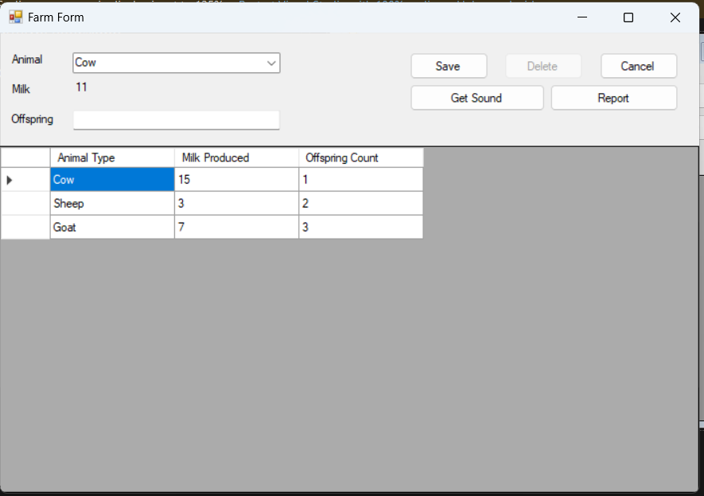

# Farm WinForms Application

## Overview

This is a simple Windows Forms (WinForms) application that simulates a farm, including features such as managing cows, sheep, and goats. The application tracks animals' sounds, milk production, and statistics related to the farm.

## Features

Manage different types of farm animals (Cows, Sheep, Goats)
Track animal sounds and milk production
View farm statistics (number of animals, milk yield, etc.)
User-friendly interface for managing farm data
Setup and Installation
Follow the steps below to clone, set up, and run the project on your local machine.

## Prerequisites

* Visual Studio (2019 or later)
* SQL Server Management Studio (SSMS)
* .NET Framework 4.7.2
* SQL Server installed locally or remotely

## Step-by-Step Instructions

1. **Clone the Repository** Clone the repository from your Git hosting service (e.g., GitHub) using the command below in your terminal or command prompt:

    ```bash
    git clone
    ```

2. **Create a New Database**

* Open SQL Server Management Studio (SSMS).

* Create a new database for the farm application by executing the following query:

    ```sql
    CREATE DATABASE FarmDB;
    ```

3. **Run SQL Script to Create Tables**

* Locate the SQLCreate.sql file in the root of the project.

* Execute the SQL script in SSMS to create the necessary tables:

    ```bash
    -- Right-click on the database 'FarmDB' -> New Query -> Paste and run the script from `SQLCreate.sql`
    ```

4. **Open the Project in Visual Studio**

* Launch Visual Studio and open the solution (`FarmWinForms.sln`).
* Ensure that you have the appropriate packages and dependencies installed by right-clicking the solution and selecting Restore NuGet Packages if needed.

5. **Update ADO.NET Entity Data Model**

* Navigate to the ADO.NET Entity Data Model in the project.
* Right-click on the model and select Update Model from Database.
* Choose the correct connection to the FarmDB database created earlier, and ensure that all tables are selected to be imported into the model.

6. **Update the Connection String**

* Open the App.config file located in the project root.

* Update the connection string to point to your local or remote SQL Server instance. Example connection string:

```xml
<connectionStrings>
    <add name="FarmDBEntities"
         connectionString="metadata=res://*/FarmModel.csdl|res://*/FarmModel.ssdl|res://*/FarmModel.msl;provider=System.Data.SqlClient;provider connection string=&quot;Data Source=YOUR_SERVER_NAME;Initial Catalog=FarmDB;Integrated Security=True;MultipleActiveResultSets=True&quot;"
         providerName="System.Data.EntityClient" />
</connectionStrings>
```

* Replace YOUR_SERVER_NAME with the name of your SQL Server instance.

7. Build and Run the Project

* Build the project in Visual Studio by selecting Build > Build Solution or pressing `Ctrl + Shift + B`.
* Run the project by pressing F5 or selecting Debug > Start Debugging.

## Screenshot

